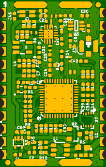
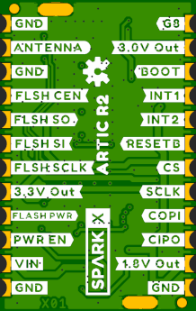
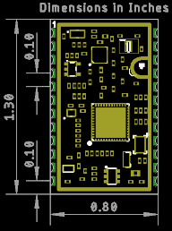

# ARGOS ARTIC R2 Castellated Module

The [ARGOS ARTIC R2 satellite communication chipset](https://www.cls-telemetry.com/argos-solutions/argos-products/modems/artic-chipset/#1534863095666-398318f3-c367) in castellated module format.

The ARTIC-R2 is an integrated low power small size ARGOS 2/3/4 single chip radio. ARTIC-R2 implements a message based wireless interface. For satellite uplink communication, ARTIC-R2 will encode, modulate and transmit provided user messages. For downlink communication, ARTIC-R2 will lock to the downstream, demodulate and decode it and extract the satellite messages.

The ARTIC-R2 can transmit signals in frequency bands around 400MHz and receive signals in the bands around 466MHz, in accordance with the ARGOS satellite system specifications. The ARTIC-R2 is compliant to all ARGOS 3 and ARGOS 4 RX and TX standards. It contains a RF transceiver and frequency synthesizer and a digital baseband modem. The ARTIC-R2 contains an on-chip power amplifier delivering 1mW [0dBm] output power, that serves as an output for connecting an external high efficient PA. The (de)modulation algorithms run on an on-chip DSP. This software approach allows for retargeting the ARTIC for other applications. The DSP program can be retained on an external flash or the MCU.

- Serial interface (SPI) for communication with MCU
- Programmable DSP core on board to ensure flexibility
- RX frequency : 466MHz – TX frequency: 400MHz
- Fractional N frequency synthesis
- Supported TX standards:
  - BPSK: PTT-A2 (ARGOS 2), PTT-VLD (ARGOS 4)
  - QPSK: PTT-A3, PTT-ZE (ARGOS 3)
  - GMSK: PTT-HD (ARGOS 3), PTT-MD (ARGOS 4), PTT-HD (ARGOS 4)
- Supported RX standards:
  - BPSK: PMT-A3 (ARGOS 3)
  - DSSS OQPSK: PMT-A4 (ARGOS 4) not available
- Dedicated flash Interface to retain Firmware
- Support COSPAS-SARSAT standard
- Operates on external 26MHz reference clock
- Dual supply, 1.8V and 3.3V
- Integrated PA (0dBm) to combine with external PA

An RFPA0133 programmable gain power amplifier boosts the 0dBm (1mW) output from the ARTIC by _approximately_ 26.5dB, producing a transmit power level of _approximately_ 450mW. The transmit power can be adjusted via the **G8** pad.

The ARGOS satellite system is restricted to specific programs and applications. Please check that your project meets these requirements before buying hardware. CLS and the Woods Hole Group will be able to advise if your project meets the requirements.
- _**"To meet system use requirements, all programs using Argos have to be related in some way or other to environmental protection, awareness or study, or to protecting human life."**_

## Pads

Starting Top Left, going Counter-Clockwise:

| Pad | Name | I/O | Description |
|---|---|---|---|
| **1** | **G8** | INPUT | Pull up to 3.3V to set the RFPA0133 transmit power to maximum. The transmit power will be reduced by _approximately_ 5dB if this pin is pulled low or left open. |
| **2** | **3.0V** | OUTPUT | This pad allows measurement of the module's internal 3.0V rail. |
| **3** | **BOOT** | INPUT | Connected to the ARTIC BOOT pin. Pulled up to 3.3V via a 100k resistor. When high, the ARTIC boots from the external flash memory. Pull low if the ARTIC firmware will be downloaded by the MCU via SPI. |
| **4** | **INT1** | OUTPUT | Connected to the ARTIC INT1 pin. Will be pulled up to 3.3V by the ARTIC to indicate (e.g.) an RX_VALID_MESSAGE. |
| **5** | **INT2** | OUTPUT | Connected to the ARTIC INT2 pin. Will be pulled up to 3.3V by the ARTIC to indicate (e.g.) an RX_BUFFER_OVERFLOW. |
| **6** | **RESETB** | INPUT | Connected to the ARTIC reset pin. Pulled up to 3.3V via a 100k resistor. Pull low to reset the ARTIC. |
| **7** | **CS** | INPUT | SPI interface Chip Select. 3.3V. Active low. |
| **8** | **SCLK** | INPUT | SPI interface clock signal. Typically 1MHz. 3.3V. See the ARTIC R2 datasheet for the permitted clock speeds. |
| **9** | **COPI** | INPUT | SPI interface: Controller Out Peripheral In. 3.3V. |
| **10** | **CIPO** | OUTPUT | SPI interface: Controller In Peripheral Out. 3.3V. |
| **11** | **1.8V** | OUTPUT | This pad allows measurement of the module's internal 1.8V rail. |
| **12** | **GND** | | Power ground / 0V. |
| **13** | **PWR EN** | INPUT | Pulled low via a 10k resistor. Pull up to 3.3V to enable power for the ARTIC R2. |
| **14** | **VIN** | INPUT | 3.3V power supply for the module. **Voltage must be: 3.3V +/- 0.1V**. Current limit: 500mA. |
| **15** | **VIN** | INPUT | 3.3V power supply for the module. **Voltage must be: 3.3V +/- 0.1V**. Current limit: 500mA. |
| **16** | **GND** | | Power ground / 0V. |
| **17** | **FLSH_SCLK** | OUTPUT | Clock signal for external SST25VF020B 2-Mbit SPI Serial Flash. Connect to the flash memory SCK pin. |
| **18** | **FLSH_SI** | OUTPUT | Serial Data In for external SST25VF020B 2-Mbit SPI Serial Flash. Connect to the flash memory SI pin. |
| **19** | **FLSH_SO** | INPUT | Serial Data Out for external SST25VF020B 2-Mbit SPI Serial Flash. Connect to the flash memory SO pin. |
| **20** | **FLSH_CEN** | OUTPUT | Chip Enable for external SST25VF020B 2-Mbit SPI Serial Flash. Connect to the flash memory CE pin. |
| **21** | **3.3V** | OUTPUT | This pad allows measurement of the module's internal 3.3V rail (switched). Can be used to provide power for the external flash memory. |
| **22** | **GND** | | Power ground / 0V. |
| **23** | **ANTENNA** | RF | Antenna connection (50 Ohm). Connected internally to the center pin of the u.FL connector. |
| **24** | **GND** | | Power ground / 0V. |

The full schematic for the ARTIC R2 module is available [here](./Hardware/Schematic.pdf).

## Antenna

The antenna is connected via a uFL connector or the Antenna pad. A 400MHz quarter wave wire antenna is all that is required for most applications.

## Arduino Library

The [SparkFun ARGOS ARTIC R2 Arduino Library](https://github.com/sparkfun/SparkFun_ARGOS_ARTIC_R2_Arduino_Library) contains a full set of examples
to get you up and running with the ARTIC R2 Breakout.

## Repository Contents

- [**/Hardware**](./Hardware) - Eagle PCB, SCH and LBR design files
- [**LICENSE.md**](./LICENSE,md) - contains the licence information

## Thanks

The ARTIC R2 module is a remix of the reference design kindly provided by the Arribada Initiative and Icoteq Ltd.
